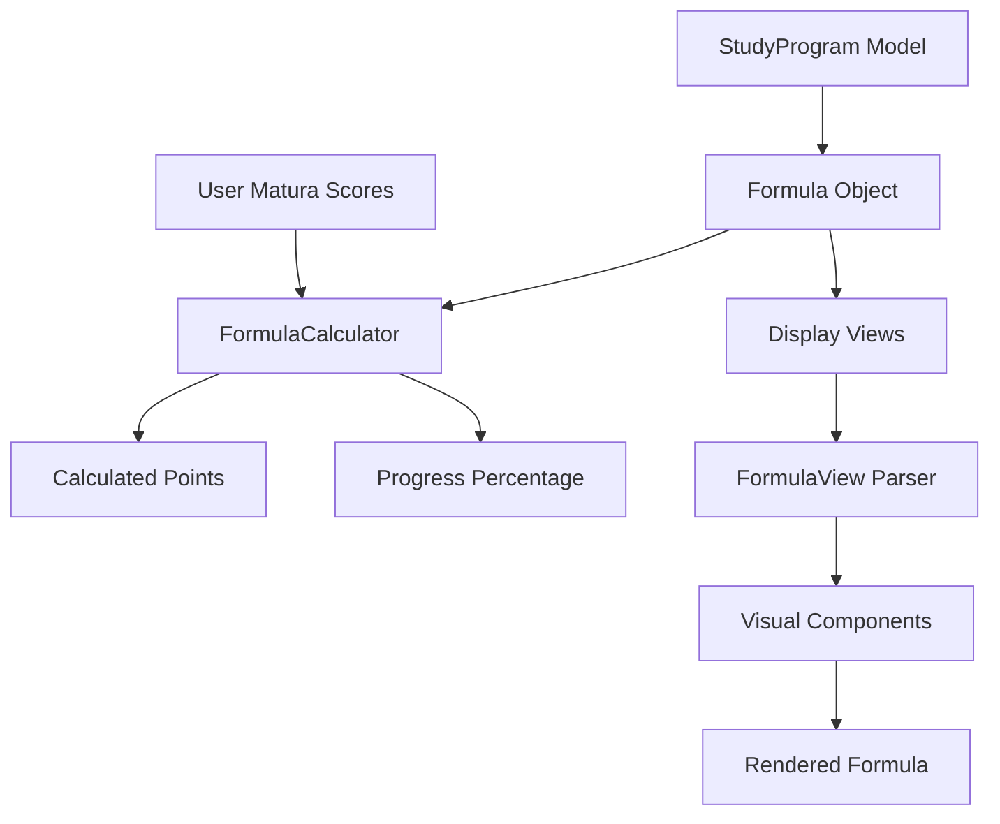

# Formula System Guide - Rekrut App

## Table of Contents
1. [Overview](#overview)
2. [Formula Model Architecture](#formula-model-architecture)
3. [Formula Types](#formula-types)
4. [Storage Format](#storage-format)
5. [Calculation Engine](#calculation-engine)
6. [Display System](#display-system)
7. [Integration Flow](#integration-flow)
8. [Examples](#examples)

## Overview

The Rekrut app uses a sophisticated formula system to calculate admission points for Polish universities. The system is designed to handle the complexity and diversity of admission requirements across different universities and programs.

### Key Components
- **Formula Model** (`Formula.swift`) - Core data structure
- **FormulaCalculator** (`FormulaCalculator.swift`) - Calculation engine
- **FormulaFactory** (`FormulaFactory.swift`) - Pre-built templates
- **Display Views** - Visual representation of formulas
- **Python Parser** (`formula_parser.py`) - Cross-platform support

## Formula Model Architecture

### Formula v2.0 Structure

```swift
struct Formula: Codable, Equatable {
    let version: String = "2.0"
    let type: FormulaType
    let stages: [Stage]
    let metadata: FormulaMetadata
    let requirements: FormulaRequirements?
    let bonusSystem: BonusSystem?
}
```

### Core Components

1. **FormulaType**
   - `.simple` - Single-stage weighted sum
   - `.multiStage` - Multiple recruitment stages
   - `.mixed` - Combines exams with practical tests
   - `.conditional` - Different paths based on conditions

2. **Stage** - Represents a recruitment stage
   ```swift
   struct Stage {
       let name: String
       let weight: Double
       let components: [Component]
       let requiredScore: Double?
   }
   ```

3. **Component** - Individual scoring element
   ```swift
   struct Component {
       let name: String
       let type: ComponentType
       let weight: Double
       let operation: Operation?
       let subjects: [String]?
       let levelCoefficients: LevelCoefficients?
   }
   ```

## Formula Types

### 1. Simple Formula
Most common type - weighted sum of matura exam scores:
```
W = 0.5 × matematyka (R) + 0.3 × fizyka (R) + 0.2 × język obcy (R)
```

### 2. Multi-Stage Formula
Used for programs with multiple recruitment phases:
```
Stage 1: Matura exams (60%)
Stage 2: Entrance exam (40%)
```

### 3. Mixed Formula
Combines traditional exams with practical assessments:
```
W = 0.4 × matura points + 0.6 × portfolio score
```

### 4. Conditional Formula
Different calculation based on candidate's profile:
```
If has extended math: Use Formula A
Else: Use Formula B with entrance exam
```

## Storage Format

### In StudyProgram Model
```swift
struct StudyProgram {
    let requirements: AdmissionRequirements
    // requirements.formula contains the Formula object
}
```

### Formula Description Format
Formulas are stored with human-readable descriptions:
```swift
formula.metadata.description = "0.5 × matematyka (R) + 0.3 × fizyka (R)"
```

### Level Indicators
- `(R)` - Rozszerzony (Extended level)
- `(P)` - Podstawowy (Basic level)
- No indicator - Either level accepted

### Subject Abbreviations
```
mat = matematyka
fiz = fizyka
chem = chemia
inf = informatyka
bio = biologia
pol = język polski
ang = język angielski
j.ob = język obcy
geo = geografia
hist = historia
WOS = wiedza o społeczeństwie
```

## Calculation Engine

### FormulaCalculator Features

1. **Score Calculation**
   ```swift
   func calculateScore(formula: Formula, scores: ScoreInput) -> CalculationResult
   ```

2. **Level Coefficients**
   - Basic level: 0.4
   - Extended level: 1.0
   - Bilingual: 1.3

3. **Operations**
   - `max()` - Highest score from subjects
   - `min()` - Lowest score from subjects
   - `sum()` - Sum of all subjects
   - `average()` - Average of subjects

4. **Bonus Points**
   - Olympiad achievements: up to 200 points
   - Language certificates
   - Other competitions

### Calculation Process
1. Extract scores from user's matura results
2. Apply level coefficients
3. Execute operations (max, min, etc.)
4. Apply component weights
5. Sum all components
6. Add bonus points
7. Check thresholds and requirements

## Display System

### FormulaView Parser

The formula display system parses text formulas into visual components:

1. **Parsing Steps**
   - Split by operators (+, -, ×, /)
   - Identify components (coefficients, subjects, operations)
   - Extract level indicators
   - Format for display

2. **Visual Elements**
   ```swift
   enum FormulaElement {
       case coefficient(Double)
       case subject((name: String, level: String))
       case mathOperator(String)
       case maxFunction([(name: String, level: String)])
   }
   ```

3. **Rendering**
   - Coefficients: Rounded numbers
   - Subjects: Abbreviated names with superscript levels
   - Operators: Mathematical symbols
   - Max functions: Grouped with parentheses

### ProgramDetailView Integration

The formula is displayed in program details with:
- Formula card with mathematical notation
- Legend explaining symbols
- Subject abbreviation guide
- Color-coded elements

## Integration Flow



## Examples

### Example 1: Computer Science Program
```swift
let formula = FormulaFactory.createComputerScienceFormula()
// Result: "0.5 × matematyka (R) + 0.3 × informatyka (R) + 0.2 × język obcy (R)"
```

### Example 2: Medicine Program
```swift
let formula = FormulaFactory.createMedicineFormula()
// Result: "0.4 × biologia (R) + 0.4 × chemia (R) + 0.2 × max(matematyka, fizyka) (R)"
```

### Example 3: Architecture (Multi-stage)
```swift
let formula = FormulaFactory.createArchitectureFormula()
// Stage 1: "0.6 × rysunek + 0.4 × matematyka (R)"
// Stage 2: Portfolio review
```

### Example 4: User Progress Calculation
```swift
// User's matura scores
let scores = MaturaScores(
    mathematics: 85,      // Extended level
    physics: 72,         // Extended level
    foreignLanguage: 90  // Extended level
)

// Calculate progress for CS program
let progress = program.calculateProgress(maturaScores: scores)
// Returns: 1.15 (115% - exceeds threshold)
```

## Advanced Features

### 1. Conditional Requirements
Some programs have additional requirements:
```swift
requirements: FormulaRequirements(
    minimumScores: ["matematyka": 30],
    requiredSubjects: ["fizyka", "informatyka"],
    excludedSubjects: nil
)
```

### 2. Bonus System
```swift
bonusSystem: BonusSystem(
    olympiadPoints: [
        "mathematics": 200,
        "informatics": 200,
        "physics": 150
    ],
    certificatePoints: [
        "CAE": 50,
        "CPE": 100
    ]
)
```

### 3. Cross-Platform Support
The Python parser (`formula_parser.py`) ensures formulas work consistently across:
- iOS app
- Backend services
- Data analysis tools

## Best Practices

1. **Formula Creation**
   - Use FormulaFactory for common patterns
   - Include clear descriptions
   - Specify all level requirements

2. **Display**
   - Always show the legend for first-time users
   - Use consistent abbreviations
   - Highlight user's strong/weak areas

3. **Calculation**
   - Validate all inputs
   - Handle missing scores gracefully
   - Provide clear error messages

4. **Storage**
   - Keep formulas versioned
   - Store both structured data and descriptions
   - Cache calculated results

## Troubleshooting

### Common Issues

1. **Formula Not Displaying**
   - Check if formula.metadata.description exists
   - Verify formula parsing in logs

2. **Incorrect Calculations**
   - Verify level coefficients
   - Check if all required scores are provided
   - Validate formula structure

3. **Display Issues**
   - Ensure proper spacing in formula string
   - Check for special characters
   - Verify subject name mappings

## Future Enhancements

1. **Formula Builder UI** - Visual tool for creating formulas
2. **Formula Validation** - Real-time syntax checking
3. **Historical Analysis** - Track formula changes over years
4. **AI Suggestions** - Recommend optimal subject combinations
5. **Export/Import** - Share formulas between institutions